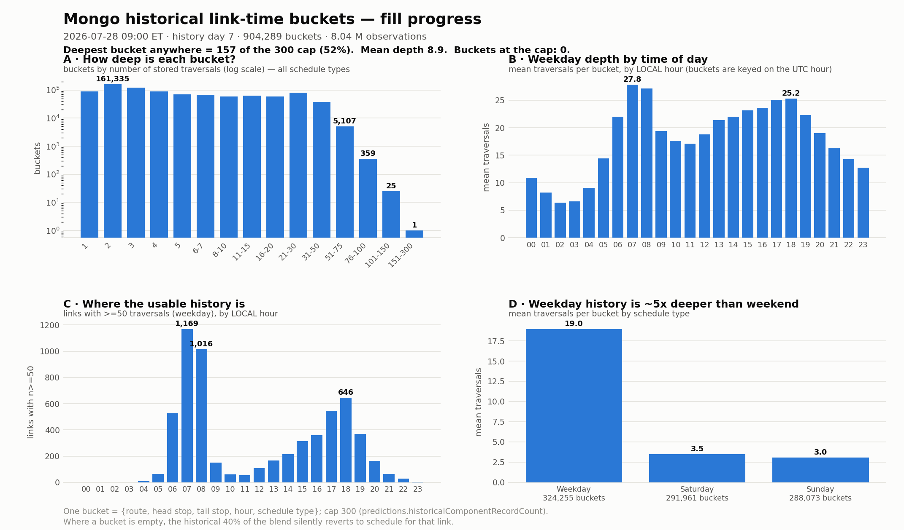

# Discrepancy investigation — 2026-07-27 PM peak (run 5)

Comparison of our EC2 OBA GTFS-RT against MTA's production Bus Time GTFS-RT, run per
[`COMPARISON-RUNBOOK.md`](COMPARISON-RUNBOOK.md). This document categorises every discrepancy
class observed, states the root cause with the evidence behind it, and gives the fix path.

- **Window:** 2026-07-27 17:10–17:14 EDT (4 rounds × 60 s) + drill-downs to 17:47. **PM peak** — the
  same service regime as the 07-24 17:47 run, though not the same clock time, which is why §1b
  re-runs the comparison over an identical archived window.
- **State:** Mongo history day 6 (first run with weekend data included); bundle unchanged (C6);
  config unchanged (weights 20/40/40, `CURRENT_TRIP`, shedding armed at 50 s).
- **Raw output:** [`feed-comparison-2026-07-27-pm.md`](feed-comparison-2026-07-27-pm.md);
  drill-down [`discrepancy-detail.txt`](discrepancy-detail.txt).

## 1. Headline result

| metric | 07-24 PM peak | **07-27 PM peak** | change |
|---|---|---|---|
| same trip_id | 96.5% | **97.1%** | ↑ 0.6 pt |
| same route, diff trip | 3.4% | 2.6% | ↓ |
| direction flips | 0.2% | 0.3% | ≈ |
| ETA MAE — ALL | 41 s | **37 s** | ↓ 10% |
| ETA MAE — 0-5 / 5-15 / 15-30 / 30+ min | 16 / 24 / 36 / 70 | **16 / 23 / 34 / 59** | ↓ at long horizon |
| ETA median — ALL | −4 s | −4 s | flat |
| ETA median — 30+ min | −13 s | −10 s | flat/slightly ↓ |
| express MAE | 108 s | 97 s | ↓ 10% — **but see §1b, the fixed-window run disagrees** |
| local MAE | 35 s | 32 s | ↓ |
| NYCT vehicle coverage | 98–99% | 97.4% | ≈ |
| vehicles ours / prod | 2538 / 3406 | 2596 / 3414 | ≈ |

Six-day trend (mixed time-of-day, so read the PM-peak columns against each other only):
MAE 53 → 45 → 41 (PM) → 37 (AM) → **37 (PM)**.

**Two conclusions up front:**

1. **The "growing early bias" flagged on 07-27 AM is not growing, and is mostly not ours.**
   At like-for-like PM peak the overall median is flat (−4 s both runs) and the 30+ min median
   narrowed (−13 → −10 s). §5 decomposes the residual: the local-bus component is almost entirely a
   *measurement artifact of prod's staler position anchor*, and what remains is an express-route
   effect.
2. **One genuinely new defect: route B1 (NYCT) is ~0% covered in our feed, all day.** This is the
   condition the runbook names as alarming ("NYCT routes start appearing in the missing list"). It
   was present on 07-24 as well but was absorbed into the MTABC route list. Root cause and evidence
   in §3.

## 1b. Confounder-free cross-day check (identical clock window)

The live runs above were sampled at 17:47 (07-24) and 17:10 (07-27), so their day-over-day deltas
still carry a time-of-day confounder. Replaying the S3 archives for the **same 17:25–17:35 window**
on both dates (new `compare-archives.py`, 31 vs 48 snapshot pairs, 1.4 M / 2.3 M stop-prediction
deltas, median pairing skew 5 s):

| metric | 07-24 (Fri) 17:25–17:35 | 07-27 (Mon) 17:25–17:35 |
|---|---|---|
| same trip_id | 96.6% | **97.2%** |
| same route / diff trip | 3.1% | 2.4% |
| ETA median / MAE — ALL | −6 s / 37 s | −5 s / 38 s |
| — 0-5 min | −2 / 13 | −2 / 13 |
| — 15-30 min | −8 / 35 | −6 / 33 |
| — 30+ min | −16 / 60 | **−13 / 65** |
| local | −5 / 32 | −4 / 30 |
| express | −29 / 88 | **−32 / 119** |

This is the cleaner measurement, and it says:

- **Trip matching genuinely improved** (96.6 → 97.2%), and **local predictions improved** (MAE 32 → 30 s).
- **The early bias is flat to slightly shrinking** at every horizon — independent confirmation that
  it is not growing (30+ min median −16 → −13 s).
- **Express got worse, not better.** The live pairing suggested express MAE 108 → 97 s; at a fixed
  clock window it is **88 → 119 s** with the bias slightly deeper (−29 → −32 s). The live
  "improvement" was a time-of-day artifact (17:47 vs 17:10 sampling). Treat the fixed-window number
  as authoritative and the express class as **regressing or at best noisy**, not improving.
  Residual confounder: 07-24 is a Friday and 07-27 a Monday, and express is the most
  day-of-week-sensitive service class. Needs a Mon-vs-Mon window next week to settle.

**Host health (confounder check, CloudWatch `OBA/Prod`, 16:15–17:15):** `InferenceShedFixes` = **0**
for the whole window (no load-shedding — unlike the 07-24 PM run), `InferenceBacklogThreads` avg
1.1k–2.0k, `FeedStalenessSeconds` 3–7 s, `TripUpdateEntities` ~2.6k. The host was *not* under
duress, so none of the below is shedding-induced.

---

## 2. Class A — MTABC fleet absent (unchanged, known)

**Signature.** 792 MTABC vehicles and 91 routes in prod, zero in ours (Q06–Q115, B100/B103,
QM/BM/BXM, SIM8/10). Ours 2,655 vehicles vs prod 3,483.

**Root cause (previously code-confirmed, unchanged):** no MTABC STIF in the bundle → no DSC→trip
sign-code map and no run data → `hasValidDsc=false` → snap generation skipped
(`BlocksFromObservationServiceImpl.java:196-207`), spatial snaps discarded by
`_requireDSCImpliedRoutes` / `_requireRunMatchesForNullDSC` (`BlockStateService.java:115,122,489-506`),
and DSC/run candidate generation returns empty (`:357-373`).

**Fix:** obtain MTABC STIF, rebuild the bundle. No change expected until then.

---

## 3. Class B — **NEW: route B1 (NYCT) missing from our feed all day**

**Signature.**

- Prod runs 10–15 B1 vehicles continuously; our feed has **0** at every sampled window across
  2026-07-27 (06:00 → 17:10), except a single window at 08:00 with 2 vehicles — both pinned to the
  *same* trip `UP_C6-Weekday-SDon-046400_B1_2`, one of them with a single stop prediction.
- Per-route coverage sweep at 17:2x: B1 is the only NYCT route below 20% (0/15). The next worst are
  small-n Staten Island / branch-variant labels (S81 20%, Q84 25%, S42 25%, BX18A/B ~50%) which are
  route-labelling variants, not lost vehicles. NYCT total across routes with ≥3 prod vehicles:
  ours 2,587 / prod 2,737 = **94.5%**.

**Root cause — route-scoped, not vehicle- or ingestion-scoped.** The decisive test: three buses
(7163, 7165, 7563) rotate between B1 and B6/B36/B64 during the day. Tracking them window by window
against prod:

| prod says the bus is on… | present in our feed | absent from our feed |
|---|---|---|
| B1 | 2 | **25** |
| B6 / B36 / B64 | 18 | 1 |

The same physical buses, the same AVL stream, the same depot — inferred normally on their other
routes and dropped whenever they display B1. Ingestion and the depot filter are therefore ruled out
(`acceptAllVehicles=true` anyway), as is a missing route in the bundle: our feed *did* emit real B1
trip ids (`UP_C6-Weekday-SDon-046400_B1_2`), so B1 trips and geometry exist in the C6 bundle.

That leaves the **same mechanism as the MTABC gap, scoped to one route**: the STIF-derived data for
B1 (DSC sign-code → trip mapping, and/or run data) is missing or unmatched, so every B1 observation
scores `hasValidDsc=false` with no run info, and all three candidate-block sources yield nothing —
the vehicle simply never enters the feed. The two 08:00 exceptions (both stuck on one early-morning
trip) are consistent with a stale hypothesis that was never displaced rather than with working
inference.

> **UPDATE 2026-07-28 — this root cause was investigated on the host and is PARTLY WRONG.** It is
> **not** a missing or unmatched STIF slice: the B1 STIF is present and every input verifies clean.
> The real defect is that the **bundle build** dropped 87% of B1's trips from the DSC index (DSC 4010
> absent entirely; 4011 → 7 trips), which then produces the same `hasValidDsc` failure described
> below. Q84 (50%) and Q30 (52%) are affected too. Corrected write-up with all evidence:
> **[`FINDINGS-SUMMARY.md`](FINDINGS-SUMMARY.md) §4B**; the prod-vs-us data-source inventory is §5b
> there. The paragraph below is kept for the record.

**Confirming it on the host (superseded — now done, see the update above):** grep the bundle's
DSC/sign-code artefacts for the B1 sign codes and for the `UP` depot's B1 entries, e.g. inspect the
generated `DestinationSignCode` map and STIF trip records for B1 under `/opt/oba`'s bundle directory,
and compare against a route known to work from the same depot (B6).

**Fix path.**
1. Verify the B1 sign codes are present in the C6 STIF drop (most likely a missing/short STIF file
   for that route, in the same family as the MTABC gap).
2. Re-source that STIF slice and rebuild the bundle; re-run `verify-parity.py` plus a per-route
   coverage check.
3. **Add a regression gate:** the per-route ours/prod vehicle ratio (script used here) should be run
   with every comparison — a route at 0% is invisible in the aggregate 97.4% NYCT number, which is
   exactly how B1 stayed hidden for three runs.

---

## 4. Classes C/D/E — trip assignment (unchanged mechanisms, all improved)

**C. Same-route / different-trip — 196 pairs of 7,659 (2.6%; was 3.4% at 07-24 PM peak).**
Start-time gap between our trip and prod's: median 10 min, mean 16.5, max 157; only 3 cases are
simultaneous departures. In **137/196** cases the trip we chose is in prod's feed *on a different
vehicle*. Root cause unchanged and code-confirmed: no UTS operator→run assignments, so
`RunLikelihood` (`:66-68`), `BlockLikelihood` (`:83-84`) and `RunTransitionLikelihood` (`:127-133`)
are flat, leaving only `ScheduleLikelihood`'s informal Student-T prior (scale ≈ 9 min,
`ScheduleLikelihood.java:42-43,166-168`) to separate departures ~10 min apart. **Fix:** TDM crew
API / YardTrek S3 access.

**D. Direction flips — 25 pairs (0.3%).** Same run id on both sides (`M98_905` vs `M98_905`,
`BX402_36` vs `BX402_36`), trips 13–98 min apart: adjacent opposite-direction trips around a
terminal. Root cause unchanged: the ≥135° orientation gate is skipped while the bus is stationary
(`BlockStateService.java:600-616`) and DSC is direction-blind
(`DestinationSignCodeServiceImpl.java:136-159`). Self-correcting on movement; same UTS fix.

**E. Different route — 1 pair in 7,659 (0.01%).** Ours M1 vs prod M7 on a shared Manhattan corridor,
and prod has our M1 trip on a neighbouring vehicle. Noise level; known corridor/DSC-preference
mechanism (`DscLikelihood.java:144-166`).

---

## 5. Class F — ETA deltas, and what actually drives the early bias

**Volume:** 264 of 7,437 trip-matched TripUpdates (3.5%) have ≥1 stop off by >3 min — **down from
7.2% on 07-22**. Shapes: 205 `drift_grows_downstream`, **49 `offset_from_start`**, 10 mid-trip bumps.
92% of the big-delta stop-predictions sit at 30+ min.

The `offset_from_start` share rose sharply (18.6% of big-delta TUs vs 1.6% on 07-22), so it was
investigated directly. It decomposes into two mechanisms, **neither of which is a prediction defect**:

### 5a. Rollover join artifact (new — a flaw in the comparison, not the feed)

Prod publishes ~1.8 TripUpdates per vehicle (current + next trip); we publish 1.00
(`PredictionLevel` `CURRENT_TRIP` vs prod's `NEXT_TRIP`). When our engine has already rolled a
vehicle onto its next trip while prod still shows it finishing the current one, the trip_id join
matches **our in-progress trip against prod's not-yet-started trip**. Every ETA then differs by a
near-constant offset that measures *rollover timing*, not prediction quality.

Measured over 7,442 trip-matched pairs: **35 pairs (0.5%, 27 vehicles) match prod's next/later trip
rather than its current one.** Their impact is concentrated in the tail:

| bucket | prod-current pairs | rollover pairs |
|---|---|---|
| ALL | n=136,304, median −3 s, MAE 36 s | n=1,041, median +0 s, **mean −71 s, MAE 108 s** |
| 30+ min | n=45,977, median −9 s, MAE 56 s | n=461, median +3 s, **mean −146 s, MAE 193 s** |

Worked example: vehicle 8767 (Q84). Prod has it finishing `100400_MISC_837` (3 stops left) and
publishes `105500_MISC_837` as a *future* trip starting 17:35; our feed already has it on
`105500_MISC_837` as the current trip. The join produced a −23 min "error" that is purely the gap
between "in progress" and "scheduled to start".

**Fixes.** (i) Tooling: restrict the ETA join to prod's *current* TripUpdate (index 0) — a one-line
change in `compare-feeds.py`; the trip-matching classification should still consider all of prod's
trips. (ii) Product: set `predictions.PredictionLevel=NEXT_TRIP` (EC2-DEPLOYMENT §11) so the two
feeds have the same shape and the ambiguity disappears.

### 5b. Position-anchor staleness explains most of the *local* early bias

Prod's VehiclePositions are **~22–25 s older than ours** (probe: prod median 37 s / p90 49 s vs ours
13 s / 30 s). A prediction anchored to where the bus was 25 s ago reads *later* than one anchored to
where it is now — which shows up as "we predict earlier".

Cross-tabbing median delta by inter-feed position distance × horizon (trip-matched, rollover pairs
excluded) separates this from a genuine link-time difference:

**local**

| distance between the two feeds' positions | 0-5 min | 5-15 min | 15-30 min | 30+ min |
|---|---|---|---|---|
| 0–50 m (feeds agree on position) | **+3** | **+2** | **+0** | **−3** |
| 50–150 m | −4 | −6 | −10 | −15 |
| 150–400 m | −16 | −17 | −22 | −30 |
| 400 m+ | – | −56 | −80 | −60 |

**express**

| distance | 0-5 min | 5-15 min | 15-30 min | 30+ min |
|---|---|---|---|---|
| 0–50 m | +0 | −5 | −10 | **−70** (n=3,166) |
| 50–150 m | +1 | −1 | −17 | −57 |
| 150–400 m | −14 | −22 | −30 | −86 |
| 400 m+ | – | −35 | −41 | −48 |

Reading:

- **For local buses, position agreement removes most of the bias.** In the 0–50 m stratum it is
  ~zero at short horizons and small at long ones (+3/+2/+0/−3 s in this sample); a repeat run 25 min
  later gave +9/+5/−1/**−13** s, so the residual local 30+ min bias is roughly **−3 to −13 s** rather
  than exactly zero. Either way it is an order of magnitude below the runbook's alarm threshold
  (|median| > 30 s) and far below the −30 to −45 s seen once the anchors diverge by 150–400 m.
- The bias scales cleanly with anchor divergence, and the magnitude matches the mechanism: 150–400 m
  is about the distance a bus covers in the ~22 s by which prod's position is older, and the observed
  −16 to −45 s in that stratum is that lag's worth of unreflected progress. This part is a
  **comparison artifact in our favour** — our predictions are fresher, not faster. A uniformly
  optimistic engine would instead show its bias equally in the position-agreeing stratum.
- **Express is different and is the real residual.** At 30+ min the express bias is −70 s (−41 s in
  the repeat run) *even when the feeds agree on position to within 50 m*, i.e. it survives the
  artifact control, and it deepens sharply with distance (−125 s at 150–400 m). Pooled 30+ min:
  local median −8 s (n=39,957) vs **express −67 s (n=6,313)**.
- Per-route 30+ min medians (n≥300) are two-sided, not a global policy offset: worst are
  **SIM7 −338 s, SIM1 −218 s, QM63 −109 s, SIM10 −86 s**; the other end is positive —
  **M11 +94 s, M5 +64 s, B15 +57 s, M4 +38 s**.

**Root cause of the express residual.** Note the fixed-window check (§1b) shows this class getting
*worse* day-over-day (MAE 88 → 119 s), so it is the one class not benefiting from warm-up so far.
Consistent with hypothesis (b) from the 07-27 AM run
(sample depth), sharpened: SIM/QM PM-peak *outbound* corridors are long, few-link, highway-dominated
runs whose peak-hour congestion is encoded in prod's years of link medians but sits in our
Mongo with roughly six weekday samples per time-of-day bucket. Where a link has no populated
bucket the blend silently reverts to schedule per link (PRODUCTIONIZING §3), and schedule is
faster than a jammed Gowanus/Staten Island Expressway. It is *not* explained by cold-start
generally — local 30+ min is nearly unbiased — and not by a deliberate global policy difference,
since the per-route signs go both ways.

**What this means for hypothesis (a) vs (b) vs (c) in the runbook:** (a) is real but is a
*measurement* effect of prod's coarser position cadence rather than of link-median interpolation,
and it accounts for the bulk of the local bias; (b) is the live explanation for the express residual
and predicts it shrinks over the coming weeks; (c) is not supported — a policy offset would be
one-signed across routes, and it isn't. Which engine is *more accurate* at 30+ min remains
unanswerable without ground truth (PRODUCTIONIZING §5).

---

## 6. Class G — vehicles only in our feed (unchanged, benign)

50 vehicles are in our VehiclePositions but not prod's; **none of them appear in prod's
TripUpdates either**, and their position age is skewed old (median 20 s, p90 169 s). Consistent with
the known cause: prod filters unassigned/ghost buses via `bustrek.mta.info/api/ghostbus/records`,
which we don't consume. Fix (optional): consume the ghost-bus feed. The residual 86-71 NYCT vehicles
missing from *our* side are dominated by B1 (§3); the rest are singletons spread across ~20 routes
with prod position ages identical to the fleet median, i.e. ordinary inference misses, not a
systematic gap.

---

## 7. Actions, in impact order

| # | action | class | effort | status |
|---|---|---|---|---|
| 1 | **Investigate the B1 STIF/DSC gap and rebuild the bundle** | B (new) | S–M | **new, needs host access** |
| 2 | Add a **per-route ours/prod coverage gate** to every comparison run | B | S | script exists, fold into `probe-coverage.py` |
| 3 | Restrict the ETA join to prod's current TripUpdate | F/5a | XS | **deliberately not applied yet** — see note |
| 4 | Set `predictions.PredictionLevel=NEXT_TRIP` to match prod's feed shape | F/5a | XS | config, seeded key |
| 5 | Obtain **MTABC STIF**, rebuild bundle (~792 vehicles, 91 routes) | A | M | known, blocked on data |
| 6 | Obtain **UTS run/operator assignments** (TDM crew API / YardTrek) | C, D | M | known, blocked on access |
| 7 | **Track the express class weekly at a fixed window** (SIM7/SIM1/QM63) — it is regressing, not warming up | F/5b | S | monitoring |
| 8 | Ground-truth scoring harness — the only way to adjudicate who is right | F | L | PRODUCTIONIZING §5 |

**Not recommended:** tuning `ScheduleLikelihood` or DSC ratios to raise agreement with prod — that
optimises toward prod's answers rather than correctness.

**Note on action 3.** `compare-feeds.py` was left unchanged on purpose: restricting the join would
redefine the headline MAE/median mid-series and break comparability with the 07-22 → 07-27 baselines
in the runbook trend table. The rollover pairs are only 0.5% of the join and shift ALL-bucket MAE by
well under 1 s, so the cost of leaving it is small and quantified. Recommended sequence: make the
change together with a bundle or config change that already forces a new baseline, and keep
`analyze-bias.py` as the way to see the artifact-free numbers in the meantime.

## 8. Method note — new tooling

[`compare-archives.py`](compare-archives.py) was added: it replays the S3 archives for the **same
wall-clock window on different dates**, pairing snapshots by GTFS-RT `header.timestamp`, which
removes the time-of-day confounder that limits the live runs. It reproduced the 07-24 live numbers
closely (same trip_id 96.6% vs live 96.5%, MAE ALL 37 s) and then produced the cross-day result in
§1b — including the express finding the live runs got backwards. This is the base for the archive
scoring utility tracked in Linear; full output in
[`archive-window-2026-07-24-vs-27.md`](archive-window-2026-07-24-vs-27.md).

`probe-coverage.py` now also prints a **per-route NYCT coverage gate** (flags any route below 20% of
prod's fleet), which is the check that would have caught B1 on 07-24.

---

# Addendum, 2026-07-28 — Mongo history fill, and does depth actually help?

Added after the run above; **nothing in §1–8 is revised by it.** Two questions: how far along is the
historical-link-time fill, and on the links where history *is* deep, do our ETAs agree with prod
more than average? Sources: aggregations over `AggregateLinkTimes` on the host (read-only, via SSM)
plus archive replays of 2026-07-28 morning windows.

## 9. History fill state (history day 7)

One bucket = `{routeId, headId, tailId, timeOfDay, scheduleType}`, holding up to
`predictions.historicalComponentRecordCount` = **300** traversals plus a precomputed median. Chart
regenerated by [`make-history-fill-chart.py`](make-history-fill-chart.py).

**Totals:** 904,289 buckets, 8.04 M stored traversals, mean depth **8.9**.

**The headline: no bucket anywhere has reached the 300 cap.** The deepest is **157** (52% of cap), and
there are only 26 buckets above 100. So the "max 300 data points" case the question asked about does
not exist yet — the analysis in §10 therefore uses the deepest available tier (n ≥ 50) as "deep".

| stored traversals | buckets | share |
|---|---|---|
| 1 | 90,199 | 10.0% |
| 2 | 161,335 | 17.8% |
| 3 | 123,016 | 13.6% |
| 4 | 90,343 | 10.0% |
| 5 | 68,915 | 7.6% |
| 6–7 | 66,843 | 7.4% |
| 8–10 | 59,302 | 6.6% |
| 11–15 | 61,954 | 6.9% |
| 16–20 | 59,096 | 6.5% |
| 21–30 | 80,026 | 8.8% |
| 31–50 | 37,768 | 4.2% |
| 51–75 | 5,107 | 0.56% |
| 76–100 | 359 | 0.04% |
| 101–150 | 25 | 0.003% |
| 151–300 | 1 | 0.0001% |

**59% of buckets hold ≤ 5 traversals, and only 0.6% hold ≥ 50.** Since the historical component is a
median, a 1–3 sample bucket is a nearly meaningless estimate that still gets 40% of the blend weight.

| schedule type | buckets | mean depth | max |
|---|---|---|---|
| Weekday (1) | 324,255 | **19.0** | 157 |
| Saturday (3) | 291,961 | 3.5 | 21 |
| Sunday (4) | 288,073 | 3.0 | 23 |

Weekend history is **~5× shallower** — only one Saturday and one Sunday have elapsed since collection
started 2026-07-21, so weekend predictions are still essentially schedule-driven. Worth remembering
before reading any weekend comparison run.

By time of day (weekday), depth tracks service frequency: deepest at local **07:00 (mean 27.8)** and
08:00 (27.1) and again at 18:00 (25.2); the overnight trough is 6.4 at 02:00–03:00. Links with ≥50
traversals: **1,169 at local 07:00**, 1,016 at 08:00, 646 at 18:00, and essentially none between
00:00 and 05:00.

**Schema finding — `timeOfDay` is the UTC hour, not local.** Verified by cross-checking one link's
bucket set against the UTC-hour histogram of its raw `LinkTravelTimes` records: the per-hour counts
match the UTC histogram exactly (e.g. UTC 10 → 38 raw = 36+2 across schedule types) and do not match
a local-hour mapping. Two consequences: (a) within a season this is harmless, because the UTC offset
is a whole number of hours so bucket edges still land on local :00 — the labels are just shifted; and
(b) **at the DST change (2026-11-01) each bucket's local meaning shifts by an hour**, mixing 07:00 EDT
traffic with 06:00 EST traffic. Worth confirming the read path (`HistoricalCacheUpdater`) uses the same
UTC convention as the write path — it almost certainly does, since both derive from the same clock,
but the predictions repo is not cloned locally so this was not code-verified.

## 10. Does deep history make our ETAs match prod better? — yes, and the size depends on link length

Method ([`analyze-history-depth.py`](analyze-history-depth.py)): archive replay of **2026-07-28
07:00–07:15 and 07:30–07:45 local** (= UTC hour 11, where history is deepest), trip-matched vehicles
only. For stops **adjacent in both feeds** it computes the *per-link* difference
`(ours[i]−ours[i−1]) − (prod[i]−prod[i−1])` = our link traversal minus prod's, which isolates a single
link instead of the accumulated offset a stop-level delta carries. Each link is labelled by its Mongo
bucket depth, and only counted if its predicted crossing falls inside UTC hour 11. Two controls
applied: **dedupe** to the first observation per (vehicle, trip, link) — raw counts overstate the
sample ~30× because snapshots are 10 s apart — and **link-duration stratification**, because deep
buckets sit on high-frequency routes with short links and a short link cannot disagree by much.

**Per-link difference (deduped):**

| class | window 1 MAE | window 2 MAE | n (w1 / w2) |
|---|---|---|---|
| deep (n ≥ 50) | **5.6 s** | **5.1 s** | 8,131 / 6,423 |
| shallow (n ≤ 5) | 19.8 s | 12.4 s | 159 / 109 |
| other / unknown depth | 6.3 s | 5.7 s | 51,222 / 36,546 |
| ALL | 6.2 s | 5.6 s | 59,512 / 43,078 |

**Stop-level delta at the same stops** (secondary — not horizon-controlled):

| class | window 1 MAE | window 2 MAE |
|---|---|---|
| deep (n ≥ 50) | **26.9 s** | **21.3 s** |
| shallow (n ≤ 5) | 74.9 s | 39.5 s |
| other / unknown | 41.4 s | 25.3 s |
| ALL | 39.5 s | 24.8 s |

**The control — MAE by prod link duration** (window 1 / window 2, "–" = n < 25):

| prod link time | deep | shallow | other |
|---|---|---|---|
| 20–45 s | 4.5 / 3.8 | 6.5 / – | 4.7 / 4.2 |
| 45–90 s | 5.1 / 4.7 | 8.9 / 12.6 | 5.8 / 5.3 |
| 90–180 s | 6.1 / 5.2 | – | 7.0 / 6.2 |
| **180 s+** | **8.7 / 8.2** | **42.4 / 22.7** | 16.5 / 13.5 |

Relative error (|diff| ÷ prod link time, links ≥ 20 s): deep **4.9% / 4.3%** median, other 6.4% / 5.7%,
shallow 7.2% / 8.8%. And the effect is monotonic in depth: mean |diff| falls from 19.8 / 12.4 s at
depth 1–5, to 5.6 / 5.2 s at depth 50–79, to 5.5 / 4.2 s at depth 80–199.

**Answer to the question as asked.** Yes — but the honest framing is three-tiered:

1. **vs the overall average, the gain is small: ~8–10%** on per-link MAE (5.1–5.6 s deep vs 5.6–6.2 s
   overall) and 14–32% on stop-level MAE (21–27 s vs 25–40 s). This is because the "average" is
   already dominated by medium-depth buckets, not empty ones — most links have *some* history by day 7.
2. **vs genuinely shallow buckets, the gain is large: 2.4–3.5×** (5.1–5.6 s vs 12.4–19.8 s), and it
   survives the duration control in every band.
3. **The gain concentrates almost entirely on long links.** In the 180 s+ band deep history is worth
   ~2× against medium (8.2–8.7 vs 13.5–16.5 s) and ~3–5× against shallow (22.7–42.4 s). Short links
   are already near-identical between the engines regardless of history, because there is little room
   to disagree.

Across the 64 route-directions that have deep history in this window, median per-link MAE is 4.7 s and
the worst is 10.7 s. Best-agreeing: B46 dir 0 (3.0 s), Q39 dir 0 (3.0), S79+ dir 0 (3.2), B36 dir 1
(3.5), Q83 dir 1 (3.6), M14D+ dir 1 (3.7). Worst: B38 dir 1 (10.7), BX5 dir 1 (7.9), Q17 dir 0 (7.8),
Q43 dir 1 (7.5).

**This closes the loop on the express residual in §5b.** Express routes are **6× over-represented in
the shallow set**: 17.3% of shallow links (41 of 237 — QM63/QM64/QM68, SIM1C/23/24/30/33C, X27/X28/X38)
versus 2.8% of deep links (33 of 1,169). Express corridors combine *thin buckets* with *long links* —
precisely the 180 s+ band where shallow history costs 22–42 s per link. So the express-only long-horizon
bias found in §5b is not a separate mystery: it is the shallow-bucket penalty landing on the service
class with the longest links, and hypothesis (b) (sample depth) is now supported by the depth data
directly rather than inferred.

**Caveats.**
- The shallow tier is thin after dedupe (109–159 observations); treat its absolute values as
  indicative, though the direction is consistent across both windows and every duration band.
- "other/unknown depth" mixes medium buckets (6–49) with links having no bucket at all; it lands
  between deep and shallow as expected but is not a clean control group.
- Bucket depths were read *after* the analyzed windows, so each window's own traversals are included
  in the counts — harmless for deep-vs-shallow classification, but it means depth is slightly
  overstated relative to prediction time.
- These are **agreement-with-prod** numbers, not accuracy. Deep history moving us toward prod is
  evidence the blend is working as designed, not proof either engine is right — and prod's own
  long-horizon numbers still carry the position-anchor artifact quantified in §5b.

**What this implies for the warm-up trajectory.** The mechanism demonstrably works, and the headroom
is mostly still ahead: only 0.6% of all buckets (2.0% of weekday buckets) have ≥50 samples, 59% have
≤5, and nothing is at the 300 cap. So the 30+ min and express MAE buckets should keep improving, and
the §1b express regression should be read as noise-plus-thin-history rather than a plateau. §11
quantifies the timeline. Re-run this addendum's scripts monthly to track it.

## 11. Bucket criteria and time-to-fill (added 2026-07-28, supersedes the trajectory estimate in §10)

**Correction to §10 as first written:** it said the busiest buckets reach 300 in "8–12 more weeks."
That was the *mean* bucket's rate misapplied to the busiest ones. The correct figures are below — the
deepest bucket is about a week away, the median weekday bucket is a few months away, and most weekend
buckets are years away.

### What defines a bucket

`{routeId, headId, tailId, timeOfDay, scheduleType}` — i.e. **one directed stop-pair, on one route, in
one clock hour, on one day-type.** Direction is implicit in the ordered (head, tail) pair, so the key
is finer than route-direction.

A bucket gains one entry when **all** of these hold:

1. a bus on that route traverses that exact consecutive stop pair;
2. the head-stop crossing falls in that **UTC hour** (§9);
3. the calendar day is of that `scheduleType` (1 weekday / 3 Saturday / 4 Sunday);
4. the vehicle was **inferred** at all — so B1 and the whole MTABC fleet (§2, §3) contribute nothing,
   and their buckets stay empty regardless of how much service runs;
5. the traversal passes lattice validation — interpolation between consecutive position reports inside
   the `beforeStopDeltaThreshold` (50 m) / `afterStopEpsilonThreshold` (25 m) windows, subject to
   `latticeOldDataThreshold` (180 s) and `latticeResetVehicleIfDistanceExceeded` (1000 m).

`traversalTimes` is `$slice`-capped at 300, so **300 is a rolling window, not a finish line**: at the
cap the median reflects the trailing 300 traversals and the bucket keeps tracking current conditions.

### The fill-rate formula

    entries per qualifying day  ≈  buses per hour on that link  ≈  60 / headway_minutes
    weeks to reach N           ≈  (N − current_depth) / (rate × qualifying_days_per_week)

with `qualifying_days_per_week` = **5** for weekday buckets but only **1** for Saturday and 1 for
Sunday. That single factor is why weekend history is ~5× behind and will stay behind.

Worked examples for reaching the 300 cap from empty:

| service on the link | rate/day | weekday bucket | Saturday bucket |
|---|---|---|---|
| SBS trunk, 2-min headway | ~30 | ~2 weeks | ~10 weeks |
| 5-min headway | ~12 | ~5 weeks | ~25 weeks |
| 10-min headway | ~6 | ~10 weeks | ~50 weeks |
| 20-min headway | ~3 | ~20 weeks | ~100 weeks |

### Measured projection

Elapsed collection as of 2026-07-28 09:00 ET, from per-`serviceDate` observation counts: complete
weekdays 07-22/23/24/27 plus partial 07-21 (0.57) and 07-28 (0.32) = **4.89 weekday-equivalents**, and
**one Saturday** (07-25) and **one Sunday** (07-26), each ≈1.1 with the adjacent late-night service-day
tails. Mean rate: **3.94** traversals per weekday per bucket (3.16 Saturday, 2.76 Sunday). Applying
each bucket's own observed rate:

**Time to the 300 cap** (cumulative share of buckets):

| | ≤4 wk | ≤8 wk | ≤13 wk | ≤26 wk | ≤52 wk | >2 yr |
|---|---|---|---|---|---|---|
| Weekday (324k buckets) | 0.8% | 11% | 39% | **75%** | 92% | 1.1% |
| Saturday (292k) | 0% | 0% | 0% | 0.2% | 8% | **58%** |
| Sunday (288k) | 0% | 0% | 0% | 0.1% | 5% | **69%** |

**Time to depth 50** — the tier that §10 showed actually buys the accuracy — is far more encouraging:

| | already | ≤4 wk | ≤8 wk | ≤13 wk | ≤26 wk | >1 yr |
|---|---|---|---|---|---|---|
| Weekday | 2% | **80%** | 92% | 98% | 99% | 0% |
| Saturday | 0% | 1% | 8% | 42% | 62% | 14% |
| Sunday | 0% | 0% | 5% | 31% | 53% | 16% |

(Depth 30: 92% of weekday buckets within 4 weeks.)

### What to take from this

- **Don't wait for 300.** §10's own numbers show the benefit saturating well before the cap — depth
  80–199 was barely better than 50–79 (mean |diff| 5.5 vs 5.6 s in window 1, 4.2 vs 5.2 s in window 2).
  Depth ~30–50 is where a median stops being noise, and **~80% of weekday buckets get there within
  four weeks**. The weekday A/B should be re-measured in mid/late August, not in the autumn.
- **Weekend service is the real laggard** and no amount of waiting fixes it quickly: a Saturday bucket
  accrues one day per week by construction. If weekend accuracy matters, the options are a coarser key
  (fold Sat+Sun into one "weekend" type, or widen `minuteIntervalsInDay` beyond hourly) rather than
  patience. Both are config-level changes with an accuracy trade-off, so they need their own A/B.
- **Express stays last in line** — thin buckets *and* long links (§10), and its buckets are on the
  low-frequency end of the table above.
- **Empty-by-construction buckets never fill:** MTABC (~792 vehicles) and B1 produce no traversals at
  all, so their history is not warming up in the background — it is waiting on the bundle/STIF fixes in
  §2–3, and every day of delay is also a day of lost history for those routes.
